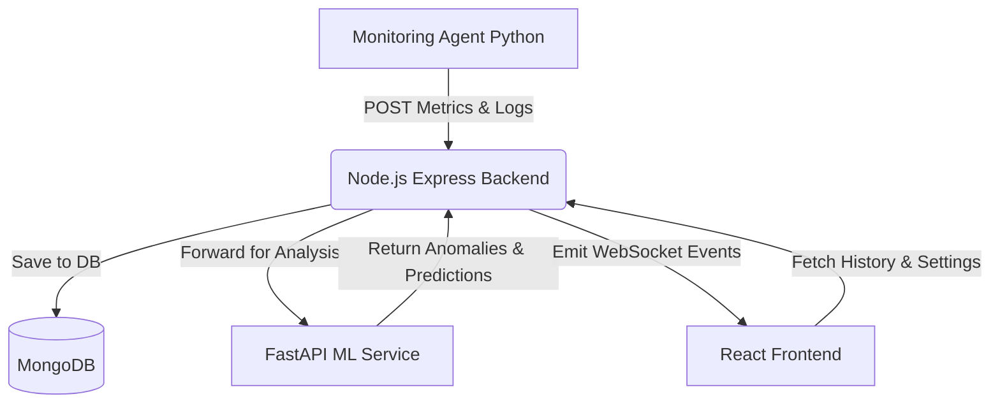

<div align="center">
  <h1>AI DevOps Monitoring Platform 🚀</h1>
  <p><strong>Next-Generation, ML-Powered Infrastructure Observability and Anomaly Detection</strong></p>
  <p>An intelligent, real-time DevOps monitoring SaaS designed to track server health, detect systemic anomalies using Machine Learning, and predict infrastructure failures before they happen.</p>
</div>

<br />

---

## 📸 2. Dashboard & Screenshots

| Live Dashboard (Real-time Metrics) | Alert Center (ML Anomalies) |
| :---: | :---: |
|  |  |
| **Server Management & Status** | **Log Stream & Classification** |
|  |  |

---

## ✨ 3. Core Features

* **📡 Real-Time Monitoring:** Live tracking of CPU, Memory, Disk, and Network I/O with sub-second latency.
* **🧠 AI Anomaly Detection:** Scikit-learn models automatically identify memory leaks, CPU spikes, and unusual network behavior.
* **🔮 Failure Prediction:** Analyzes historical metrics to predict and warn about impending systemic failures.
* **🗄️ Log Classification:** Automatically categorizes thousands of raw application logs (e.g., Network Issue, Database Error) using Natural Language Processing.
* **⚡ WebSockets (Socket.io):** Dashboard UI updates instantaneously without page refreshes when new data or alerts arrive.
* **🔒 Secure Authentication:** Robust JWT-based authentication protecting sensitive infrastructure data.
* **🐳 Docker Ready:** Full Docker and Docker Compose support for immediate, containerized deployment.
* **🖥️ Server Fleet Management:** Register, monitor, and manage unlimited nodes across different geographical regions.
* **🚨 Automated Alerts:** Real-time push notifications for critical hardware thresholds and ML-detected anomalies.

---

## 🛠️ 4. Technology Stack

### Frontend Architecture
| Technology | Purpose & Why We Chose It |
|---|---|
| **React (Vite)** | Blazing fast rendering and hot-module replacement for an optimal developer experience. |
| **Tailwind CSS** | Utility-first CSS for building a strict, minimalist monochrome design system without bloated stylesheets. |
| **Recharts** | Lightweight, highly customizable React charting library perfect for rendering high-frequency metric streams. |
| **Framer Motion** | Provides subtle, professional micro-animations for UI transitions without degrading performance. |
| **Socket.io-client** | Establishes a persistent bidirectional connection to the backend for instant UI updates. |

### Backend Architecture
| Technology | Purpose & Why We Chose It |
|---|---|
| **Node.js & Express** | Asynchronous, event-driven runtime ideal for handling thousands of concurrent monitoring requests. |
| **MongoDB & Mongoose** | NoSQL document database perfect for storing unstructured log data and high-volume time-series metrics. |
| **Socket.io** | Broadcasts incoming metrics and ML alerts to all connected frontend clients instantly. |
| **JSON Web Tokens (JWT)**| Stateless, secure authentication mechanism for protecting API endpoints. |

### Machine Learning Service
| Technology | Purpose & Why We Chose It |
|---|---|
| **Python & FastAPI** | Lightning-fast Python web framework dedicated entirely to serving ML models with minimal overhead. |
| **Scikit-learn** | Industry-standard library for training and executing our Isolation Forest anomaly detection models. |
| **Pandas & Numpy** | Essential for rapid dataframe manipulation and matrix operations during inference. |
| **Joblib** | Highly efficient serialization for loading pre-trained `.pkl` ML models into memory. |

### DevOps & Infrastructure
| Technology | Purpose & Why We Chose It |
|---|---|
| **Docker & Compose** | Containerizes the complex multi-service architecture ensuring it runs identically on any machine. |
| **psutil (Python)** | Cross-platform system monitoring library used by the agent to read raw hardware metrics. |

---

## 📐 5. System Architecture



### The Data Flow:
1. **Ingestion:** The Python `agent.py` script running on target servers collects hardware metrics and sends an HTTP POST request to the Node.js backend.
2. **Storage & ML:** The Node.js backend saves the data to MongoDB, and simultaneously fires an asynchronous request to the Python FastAPI microservice.
3. **Inference:** The FastAPI service runs the metrics through pre-trained `.pkl` Scikit-learn models. If an anomaly is detected, it returns a warning to Node.js.
4. **Real-time Broadcast:** The Node.js backend emits a `new_metric` (and potentially a `new_alert`) WebSocket event.
5. **UI Update:** The React frontend receives the WebSocket payload and instantly redraws the Recharts graphs and Alert Center.

---

## 📁 6. Folder Structure

```text
ai-devops-platform/
├── frontend/                 # React UI Application
│   ├── src/
│   │   ├── api/              # Axios configuration & API calls
│   │   ├── components/       # Reusable UI components (MetricCard, CpuChart, etc.)
│   │   ├── context/          # React Context (Auth context)
│   │   ├── pages/            # Main views (Dashboard, Logs, Servers, Alerts)
│   │   └── socket/           # WebSocket initialization
│   └── package.json
│
├── backend/                  # Node.js REST API & WebSocket Server
│   ├── src/
│   │   ├── controllers/      # Route logic (metricController, logController)
│   │   ├── middleware/       # JWT auth & error handling
│   │   ├── models/           # Mongoose schemas (Metric, Server, Log, Alert)
│   │   ├── ml/               # Axios wrapper to communicate with FastAPI
│   │   └── routes/           # Express route definitions
│   └── server.js             # Main entry point
│
├── ml-services/              # Python FastAPI Machine Learning Microservice
│   ├── app/
│   │   ├── main.py           # FastAPI server & endpoints
│   │   ├── models/           # Pre-trained .pkl Scikit-learn models
│   │   └── schemas.py        # Pydantic data validation schemas
│   └── requirements.txt      
│
└── monitoring-agent/         # Python Hardware Telemetry Agent
    ├── agent.py              # The script deployed to target servers
    └── requirements.txt
```

---

## 🔄 7. Complete Project Flow (Step-by-Step)

1. **Agent Telemetry:** The `agent.py` runs on a target machine (e.g., `prod-db-01`). Every 5 seconds, it uses `psutil` to check CPU (%), RAM (%), Disk (%), and Network I/O (MB/s).
2. **Data Transmission:** The agent packages this into JSON and sends a `POST /api/metrics` request to the backend.
3. **Database Insertion:** Node.js receives the payload, verifies the data, and saves it into the `Metrics` MongoDB collection.
4. **AI Inference Pipeline:**
   - Node.js sends the exact same payload to `http://localhost:8000/predict/anomaly` (FastAPI).
   - FastAPI loads `anomaly_model.pkl`, scales the features, and predicts.
   - If the output is `-1` (Anomaly), FastAPI responds with `isAnomaly: true`.
5. **Alert Generation:** If an anomaly is detected, Node.js creates a new document in the `Alerts` MongoDB collection with severity `WARNING` or `CRITICAL`.
6. **Socket Emission:** Node.js triggers `io.emit('new_metric', data)` and `io.emit('new_alert', alertData)`.
7. **Frontend Reaction:** The React application intercepts these socket events. It pushes the new metric into the state array for Recharts, causing the graph to slide forward seamlessly, and pops a new alert onto the Alert Center screen.

---

## 🕵️ 8. Monitoring Agent Explanation

The monitoring agent (`monitoring-agent/agent.py`) is the backbone of the platform's data gathering. 

### How it works:
* It uses the `psutil` Python library to hook directly into the host OS kernel and read hardware states.
* It calculates Network I/O by keeping a stateful memory of `bytes_sent/recv`, comparing it to the previous tick 5 seconds ago, and converting the difference to Megabytes per second (MB/s).
* It identifies the machine using `socket.gethostname()`.

### Running it on multiple machines:
To monitor an external server (e.g., an AWS EC2 instance):
1. Install Python 3.
2. `pip install psutil requests`
3. Edit `agent.py` so `BACKEND_URL` points to your deployed Node.js server.
4. Run `python agent.py` using `tmux`, `screen`, or `systemd` to keep it alive in the background.

---

## 🧠 9. Machine Learning Explanation

The platform doesn't just display data; it understands it.

### The Models
1. **Anomaly Detection (`anomaly_model.pkl`)**: 
   * **Algorithm**: Isolation Forest (Unsupervised Learning).
   * **Why**: Server metrics are mostly "normal". Isolation Forests excel at isolating sparse, abnormal data points (like a sudden memory spike coupled with zero CPU usage).
   * **Features**: CPU, Memory, Disk, Network.
2. **Failure Prediction (`failure_model.pkl`)**:
   * **Algorithm**: Random Forest Classifier (Supervised Learning).
   * **Why**: Trained on historical labeled datasets of server crashes. It recognizes the cascading patterns that happen 15 minutes before a server dies.
3. **Log Classification (`log_classifier.pkl`)**:
   * **Algorithm**: TF-IDF Vectorizer + Multinomial Naive Bayes.
   * **Why**: Text processing. It converts raw string logs into mathematical vectors, then categorizes them into actionable buckets like `Network Issue`, `Auth Failure`, or `Database Error`.

### Inference Flow
The FastAPI server keeps these models loaded in memory. When a request arrives, the data is pushed through a `StandardScaler` (to normalize the values), fed into the `.predict()` method of the `.pkl` file, and the output is instantly returned to Node.

---

## 📖 10. API Documentation

Here are the core REST API endpoints exposed by the Node.js backend:

### `POST /api/metrics`
* **Purpose**: Ingests new telemetry data from the python agent.
* **Auth**: Unprotected (Machine-to-Machine).
* **Body**:
  ```json
  {
    "serverId": "AWS-WEB-01",
    "cpuUsage": 45.2,
    "memoryUsage": 82.1,
    "diskUsage": 40.0,
    "networkUsage": 2.5
  }
  ```

### `GET /api/servers`
* **Purpose**: Returns a list of all registered infrastructure nodes and their latest status.
* **Auth**: Requires JWT (`Bearer <token>`).

### `PATCH /api/alerts/:id/resolve`
* **Purpose**: Marks an active ML anomaly or hardware alert as "Resolved" by a DevOps engineer.
* **Auth**: Requires JWT.

---

## ⚡ 11. Realtime Socket Events

The platform uses `Socket.io` to achieve 0-refresh latency.

| Event Name | Emitter | Listener | Payload Description |
|---|---|---|---|
| `new_metric` | Node.js | React | Broadcasts every 5 seconds when an agent posts data. Contains CPU/RAM stats. |
| `new_log` | Node.js | React | Emitted when an agent sends a log. Appends to the live Log table. |
| `new_alert` | Node.js | React | Emitted when CPU > 90% or ML detects an anomaly. Triggers UI notifications. |

---

## 🚀 12. Installation Guide (Without Docker)

This guide assumes you have Node.js (v18+), Python (3.10+), and MongoDB running locally.

### 1. Clone the Repository
```bash
git clone https://github.com/yourusername/ai-devops-platform.git
cd ai-devops-platform
```

### 2. Setup Machine Learning Service
```bash
cd ml-services
python -m venv venv
# Windows: .\venv\Scripts\activate | Mac/Linux: source venv/bin/activate
pip install -r requirements.txt
uvicorn app.main:app --reload --port 8000
```

### 3. Setup Backend
Open a new terminal.
```bash
cd backend
npm install
# Create your .env file (see section 13)
npm run dev
```

### 4. Setup Frontend
Open a new terminal.
```bash
cd frontend
npm install
npm run dev
```

### 5. Start the Monitoring Agent
Open a new terminal.
```bash
cd monitoring-agent
pip install -r requirements.txt
python agent.py
```
*Visit `http://localhost:5173`, register your PC name in the Servers tab, and watch the data flow!*

---

## 🔐 13. Environment Variables

Create a `.env` file in the **`backend/`** directory:

```env
PORT=5000
MONGO_URI=mongodb://127.0.0.1:27017/ai_devops
JWT_SECRET=your_super_secret_jwt_key_here
NODE_ENV=development
```

*(No `.env` is strictly required for the Frontend or ML Service by default, as they fall back to `localhost:5000` and `localhost:8000` respectively).*

---

## 🐳 14. Running With Docker

The fastest way to deploy the entire stack is via Docker Compose.

```bash
# In the root directory of the project:
docker-compose up --build
```
**Architecture under Docker:**
* `frontend` container exposes port `80`
* `backend` container exposes port `5000`
* `ml-service` container exposes port `8000`
* `mongo` container provisions the database automatically.

---

## 🌍 15. Adding New Real-World Servers

To monitor a remote server (e.g., a DigitalOcean Droplet):

1. **Deploy Backend**: Ensure your Node.js backend is accessible over the internet (via AWS, Heroku, Ngrok, etc.).
2. **Register Server**: In the web UI, go to **Servers -> Register New Server**. Type a unique ID (e.g., `UBUNTU-01`).
3. **Configure Agent**: On your remote Linux machine, open `monitoring-agent/agent.py`.
   - Change `BACKEND_URL` to your public Node.js URL.
   - Change `SERVER_ID = "UBUNTU-01"`.
4. **Run**: Execute `python agent.py`. The remote server will now appear live on your dashboard!

---

## 🏢 16. Real World Implementation

This project simulates enterprise-grade observability stacks like **Datadog**, **New Relic**, and **Grafana**. 
In a real-world scenario, companies use platforms like this to:
* Avoid costly downtime by catching memory leaks before out-of-memory (OOM) crashes occur.
* Centralize logs from microservices scattered across the globe.
* Use AI to reduce "alert fatigue" by only notifying engineers of actual anomalies, rather than minor, expected CPU spikes.

---

## 🛡️ 17. Security Features

* **JWT Authentication:** All dashboard routes and API data queries are protected by HttpOnly cookies or Authorization headers.
* **Bcrypt Password Hashing:** User passwords are encrypted before database insertion.
* **CORS Protection:** Cross-Origin Resource Sharing is strictly configured to only allow the designated frontend URL to communicate with the backend.
* **Separation of Concerns:** The ML service is kept isolated from the public internet, accessible only internally by the Node.js backend.

---

## 🔮 18. Future Improvements

* [ ] **Kubernetes Integration:** Add support for monitoring K8s pods and scraping Prometheus endpoints.
* [ ] **Slack/Email Notifications:** Integrate NodeMailer and Slack webhooks to ping on-call engineers when ML detects critical anomalies.
* [ ] **Redis Caching:** Cache the most recent metrics in Redis to reduce MongoDB read load on the `/api/metrics` endpoint.
* [ ] **Multi-Tenant RBAC:** Add Role-Based Access Control so different organizations can share the platform securely.

---

## ☁️ 19. Deployment Guide

**Frontend (Vite/React)**: Recommended to deploy on **Vercel** or **Netlify**. Simply connect your GitHub repository and set the build command to `npm run build`.
**Backend (Node.js)**: Recommended to deploy on **Render** or **Railway**. Set the `MONGO_URI` to a cloud database provider like MongoDB Atlas.
**ML Service (FastAPI)**: Can be deployed on **Render** or **AWS App Runner**.
**Agent**: Runs persistently on any machine you wish to monitor via `systemd`.

---

## 🤝 20. Contributing

Contributions are what make the open-source community such an amazing place to learn, inspire, and create. 
1. Fork the Project
2. Create your Feature Branch (`git checkout -b feature/AmazingFeature`)
3. Commit your Changes (`git commit -m 'Add some AmazingFeature'`)
4. Push to the Branch (`git push origin feature/AmazingFeature`)
5. Open a Pull Request

---

## 📄 21. License

Distributed under the MIT License. See `LICENSE` for more information.